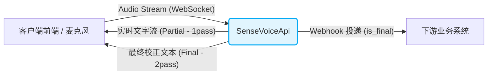

# 🎙️ SenseVoiceApi - Real-time ASR Service


**SenseVoiceApi** 是一款基于 FastAPI 构建的高性能、双向流式实时语音识别（ASR）核心服务。它集成了多款前沿的语音大模型（如 Qwen3-ASR、SenseVoice、Paraformer 等），并采用先进的 **2-pass 实时识别架构**，旨在为您提供低延迟、高精度的“边说边转”语音听写能力，并且可极其简单地与任何业务系统进行对接。

---

## ✨ 核心特性 (Features)

- ⚡️ **双通实时识别 (2-pass ASR)**: 采用两遍解码（2-pass）策略。第一遍流式极速输出中间结果（Partial），保障实时上屏体验；第二遍在端点或句末利用更强模型或完整上下文进行纠错与标点预测（Final），完美兼顾极低延迟与超高准确率。
- 🎯 **多前沿大模型支持**: 开箱即用支持以下业界前沿模型，轻松适配各类硬件算力：
  - `Qwen/Qwen3-ASR-0.6B` (LLM-based, 支持 52 种语言，推荐 GPU)
  - `FunAudioLLM/Fun-ASR-Nano-2512`
  - `iic/SenseVoiceSmall` (极速，支持情感/事件标签，CPU 友好)
  - `paraformer-zh` 及 `paraformer-zh-streaming`
- 🧩 **高度灵活与极简解耦**:
  - 自动过滤语气词、智能断句和精准标点预测。
  - 支持通过 Webhook 将最终识别结果（`is_final=true`）一键推送给指定的业务系统，实现语音能力与后端业务的彻底解耦。
- 🛠 **工程化最佳实践**: 采用 WebSocket 实现音频流式双向传输，依托 `uvicorn` 提供高并发处理能力，提供完善的 `.env` 配置隔离与断线容错机制。

---

## 🏗 架构流转 (Architecture)



---

## 🚀 快速开始 (Quick Start)

### 1. 环境准备
确保您的系统已安装 Python 3.10+，建议使用虚拟环境隔离依赖：
```bash
conda create -n asr_env python=3.10 -y
conda activate asr_env
```

### 2. 安装依赖
```bash
pip install -r requirements.txt
```
*(注：如果需要使用 Qwen3-ASR 且需发挥 GPU 性能，请确保配置好 PyTorch 的 CUDA 环境及相关模型依赖)*

### 3. 配置环境变量
修改项目根目录的 `.env` 文件，自由切换您需要的 ASR 模型：
```env
# 核心 ASR 模型选择（如切换为 Qwen3-ASR）
ASR_MODEL=Qwen/Qwen3-ASR-0.6B

# 下游业务的 Webhook 接收地址（可选配置）
WEBHOOK_URL=http://127.0.0.1:8080/api/asr/callback
```

### 4. 启动服务
```bash
uvicorn main:app --host 0.0.0.0 --port 8000 --reload
```
*服务启动后，WebSocket 接口将默认挂载在 `ws://0.0.0.0:8000/ws/asr`。首次启动会自动下载指定的模型权重，请保持网络畅通。*

---

## 📖 API 参考 (API Reference)

### 核心 WebSocket 端点：`/ws/asr`

**1. 客户端发送 (二进制音频流):**
前端通过 Web Audio 捕获数据后，直接发送 PCM/WAV 格式的二进制数据分片（推荐参数：16kHz采样率, 16bit, 单声道）。

**2. 服务端返回 (JSON 格式消息):**
实时返回识别状态与文本。利用 2-pass 架构，客户端会先频繁收到 `is_final: false` 的中间快速结果，并在端点切分时收到 `is_final: true` 的精修校正结果。
```json
{
  "is_final": true,
  "text": "测试一下实时语音识别的2-pass效果。",
  "speaker": "用户1",
  "timestamp": 1680000000000
}
```
