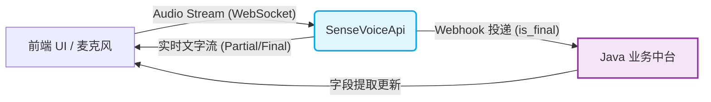

# 🏥 SenseVoiceApi - Medical ASR Service


**SenseVoiceApi** 是一款专为**智慧医疗 (AI-Hospitalized)** 场景打造的高性能实时语音识别（ASR）核心服务。基于 FastAPI 架构与先进的语音大模型生态（FunASR / SenseVoice / Paraformer），旨在将医生与患者之间的自然问诊对话，低延迟、高精度地转化为结构化的病历文本。

---

## ✨ 核心特性 (Features)

- ⚡️ **极致的实时体验**: 基于 WebSocket 的双向流式通信，边说边转，满足医疗高强度的实时录入与交互需求。
- 🎯 **多模型无缝切换**: 开箱即用支持 `SenseVoiceSmall`、`Paraformer-zh` 及多种 LLM-based ASR 模型，适配从端侧 CPU 部署到高性能 GPU 集群的多种算力环境。
- 🧩 **专为医疗流程定制**:
  - 自动过滤语气词、智能断句和精准标点预测。
  - 支持将最终识别结果（`is_final=true`）一键 Webhook 转发至 Java 业务中台。
  - 配合后端的 LangGraph4j 状态机，可完美实现**病历字段的智能提取与无感回填**。
- 🛠 **工程化最佳实践**: 依托 `uvicorn` 提供高并发处理能力，完善的 `.env` 环境隔离、多线程模型推理以及断线容错机制。

---

## 🏗 架构设计 (Architecture)

本服务在整个 AI 智慧医疗系统中扮演“超级耳朵”的角色。它将繁重的业务逻辑完全剥离，仅专注极致的语音解码，并通过消息总线或 Webhook 与中台协同：



---

## 🚀 快速开始 (Quick Start)

### 1. 环境准备
确保您的系统已安装 Python 3.10+，建议使用虚拟环境隔离依赖：
```bash
conda create -n asr_env python=3.10 -y
conda activate asr_env
```

### 2. 安装依赖
```bash
pip install -r requirements.txt
```

### 3. 配置环境变量
请查看或修改项目根目录的 `.env` 文件，调整模型加载策略或 Webhook 回调地址：
```env
# ASR 模型选择（推荐 SenseVoiceSmall 以兼顾速度与准确率）
ASR_MODEL=iic/SenseVoiceSmall

# Java 后端 Webhook 推送地址
WEBHOOK_URL=http://127.0.0.1:8081/api/medical/asr/callback
```

### 4. 启动服务
```bash
uvicorn main:app --host 0.0.0.0 --port 8000 --reload
```
*服务启动后，WebSocket 接口将默认挂载在 `ws://0.0.0.0:8000/ws/asr`。首次启动会自动下载指定模型权重，请保持网络畅通。*

---

## 📖 API 参考 (API Reference)

### 核心 WebSocket 端点：`/ws/asr`

**1. 客户端发送 (二进制音频流):**
前端通过 Web Audio API 捕获麦克风数据，直接发送 PCM/WAV 格式的二进制数据分片。

**2. 服务端返回 (JSON 格式消息):**
实时返回识别状态与文本，便于前端即时渲染。
```json
{
  "is_final": true,
  "text": "患者今天感觉头晕伴有轻微恶心",
  "speaker": "用户1",
  "timestamp": 1680000000000
}
```

---

## 💡 进阶指南
- **离线内网部署**: 首次在线启动会自动从 ModelScope 下载相关模型。如需纯内网/局域网隔离运行，可将下载好的缓存拷贝至 `models_cache` 目录并修改路径加载逻辑。
- **自定义 VAD (语音端点检测)**: 在 `.env` 中可通过 `VAD_MODEL` 随时配置不同精度的 VAD 模型，以控制断句的灵敏度和并发片段的切分长度。
